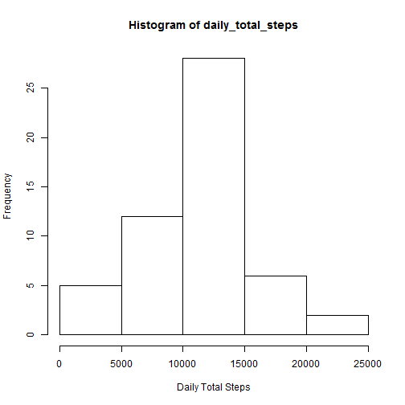
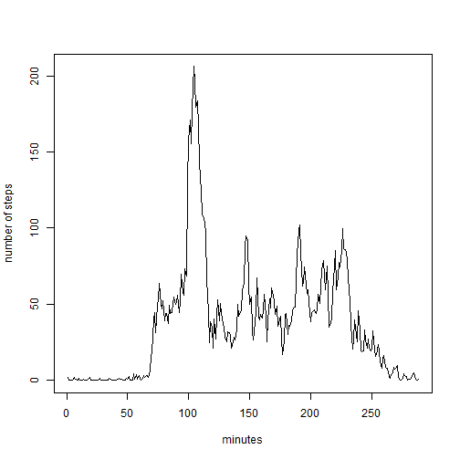

Reproducible Research Assignment 1

This is a document created as part of the peer assessment 1 of the coursera reproducible research course.

The data consists of two month of data from a personal activity monitoring device like fitbit or jawbone collected during the months of October and November 2012.


Loading and preprocessing the data

First the data is loaded followed by preprocessing

```r
data <- read.csv(file = "activity.csv", header = T)
data <- transform(data, date = as.Date(date))
str(data)
```

```
## 'data.frame':	17568 obs. of  3 variables:
##  $ steps   : int  NA NA NA NA NA NA NA NA NA NA ...
##  $ date    : Date, format: "2012-10-01" "2012-10-01" ...
##  $ interval: int  0 5 10 15 20 25 30 35 40 45 ...
```

What is mean total number of steps taken per day?

The total steps taken by day is calculated by aggregating per date (factor),

```r
daily_steps <- aggregate(data$steps, by = list(data$date), FUN = sum)
daily_total_steps <- daily_steps[!(is.na(daily_steps$x)), 2]
hist(daily_total_steps, xlab = "Daily Total Steps")
```

 


The mean and median is calculated for the total steps.

```r
mean(daily_steps$x, na.rm = T)
```

```
## [1] 10766.19
```

```r
median(daily_steps$x, na.rm = T)
```

```
## [1] 10765
```
What is the average daily activity pattern?

The average steps in 5 minutes interval is calculated and ploted.

```r
interval_means <- aggregate(data$steps, by = list(data$interval), FUN = mean, 
    na.rm = TRUE)
plot(interval_means, type = "l", xlab = "minutes", ylab = "number of steps")
```

 


The interval with the maximum steps over all days is calculated.

```r
max_mean <- interval_means[interval_means$x == max(interval_means$x), ]
max_mean
```

```
##     Group.1        x
## 104     835 206.1698
```

Missing data

There is missing data in the data set.

The number of measurements with NA for steps are:

```r
sum(is.na(data$steps))
```

```
## [1] 2304
```
These measurements with NA will be replaced by the mean of the corresponding interval (which were calculated in the above step).

```r
merged <- merge(x = data, y = interval_means, by.x = "interval", by.y = "Group.1")
my.na <- is.na(merged$steps)
merged[my.na, 2] <- merged[my.na, 4]
data2 <- data.frame(steps = merged$steps, date = merged$date, interval = merged$interval)

interval_means <- aggregate(data2$steps, by = list(data2$interval), FUN = mean)
plot(interval_means$x, type = "l", xlab = "minutes", ylab = "number of steps")
```

 


The mean and median is calculated for the total steps of the new data set.

```r
daily_steps <- aggregate(data2$steps, by = list(data2$date), FUN = sum)
mean(daily_steps$x, na.rm = T)
```

```
## [1] 10766.19
```

```r
median(daily_steps$x, na.rm = T)
```

```
## [1] 10766.19
```
With that replacement only the median has changed for just one step.


Weekday and Weekend

Create a new factor variable in the dataset with two levels -- "weekday" and "weekend" indicating whether a given date is a weekday or weekend day.

```r
daytype <- function(date) {
    if (weekdays(as.Date(date)) %in% c("Saturday", "Sunday")) {
        "weekend"
    } else {
        "weekday"
    }
}
data2$daytype <- as.factor(sapply(data2$date, daytype))
```


Make a panel plot containing a time series plot (i.e. type = "l") of the 5-minute interval (x-axis) and the average number of steps taken, averaged across all weekday days or weekend days (y-axis).

```r
par(mfrow = c(2, 1))
for (type in c("weekend", "weekday")) {
    steps.type <- aggregate(steps ~ interval, data = data2, subset = data2$daytype == 
        type, FUN = mean)
    plot(steps.type, type = "l", main = type)
}
```

 
